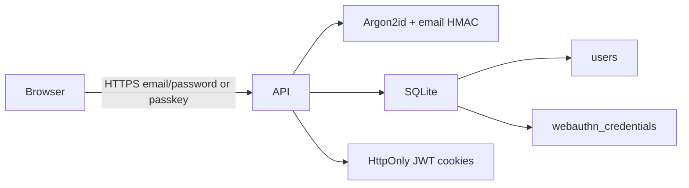

# Backend design

This document describes the Foodpocalypse API: a privacy-first Node.js (Express) service with SQLite, Argon2id passwords, WebAuthn passkeys, and stateless JWT cookies. It is the source of truth for backend architecture. Operational how-to (install, run) stays out of this file.

Code lives in [`server/`](../server/).

## Goals

- Authenticate with email/password and/or passkeys (WebAuthn).
- Store as little identifying data as possible.
- Keep session tokens off `localStorage` and out of JavaScript.
- Avoid third-party identity providers, analytics SDKs, and device fingerprinting.

## Explicit non-goals

- Social login (Google, Facebook, or any OAuth identity broker).
- Third-party analytics (Firebase Analytics, Google Analytics, Mixpanel, Facebook SDKs).
- Persistent logging of IP addresses, user-agents, screen size, or hardware IDs.
- Email verification or transactional email (that would require storing or transmitting the raw address).

## Stack

| Layer | Choice |
| --- | --- |
| Runtime | Node.js, TypeScript, ESM |
| HTTP | Express 5 |
| Database | SQLite via `better-sqlite3` + Drizzle ORM |
| Passwords | `argon2` package, **Argon2id** only |
| Passkeys | `@simplewebauthn/server` |
| Tokens | `jose` HS256 JWTs |

In development, Vite proxies `/api` to this server (`http://127.0.0.1:3001`) so the browser stays on one origin and `SameSite=Strict` cookies work. In production (`NODE_ENV=production`), Express serves `client/dist` from the same origin.

## Request flow



The API does not look up geolocation, does not persist request metadata, and does not enable `trust proxy`. `X-Powered-By` is disabled. JSON bodies are capped at 64 KB. Parse errors return `{ error: "Bad request" }` with no stack traces.

## Source layout

```
server/src/
  index.ts              HTTP bootstrap
  config.ts             env loading
  db/schema.ts          Drizzle tables
  db/index.ts           SQLite open + CREATE TABLE
  routes/auth.ts        /api/auth handlers
  auth/password.ts      Argon2id hash/verify
  auth/email.ts         normalize + HMAC
  auth/jwt.ts           access/refresh JWTs
  auth/cookies.ts       cookie flags and names
  auth/session.ts       issue both tokens
  auth/challenges.ts    in-memory WebAuthn challenges
  auth/webauthn.ts      SimpleWebAuthn wrappers
```

## Data model

SQLite file: `server/data/foodpocalypse.sqlite` (configurable via `SQLITE_PATH`). WAL mode and foreign keys are on. Tables are created on startup if missing.

### `users`

| Column | Type | Notes |
| --- | --- | --- |
| `id` | TEXT PK | UUIDv4 |
| `email_hash` | TEXT UNIQUE | HMAC-SHA256 of normalized email |
| `password_hash` | TEXT NULL | Argon2id encoded hash; null for passkey-only accounts |
| `created_at` | INTEGER | Unix milliseconds |

Raw email is never written to SQLite.

### `webauthn_credentials`

| Column | Type | Notes |
| --- | --- | --- |
| `id` | TEXT PK | UUIDv4 |
| `user_id` | TEXT FK | `users.id`, cascade delete |
| `credential_id` | TEXT UNIQUE | WebAuthn credential ID (base64url) |
| `public_key` | TEXT | Credential public key (base64url) |
| `counter` | INTEGER | Signature counter (replay protection) |
| `created_at` | INTEGER | Unix milliseconds |

No transports, AAGUID, device type, backup flags, IP, or user-agent are stored.

## Email handling

1. Trim and lowercase (`normalizeEmail`).
2. Lookup key: `HMAC-SHA256(EMAIL_PEPPER, normalizedEmail)` as hex (`hashEmail`).
3. Display: if the client sent an email at password register/login, it is copied into the JWT `email` claim only. It is not persisted. Passkey-only login issues a JWT with `sub` and no email.

`EMAIL_PEPPER` must stay secret. Rotating it invalidates every stored email hash (users cannot be looked up by email until re-hashed).

## Password hashing

Module: [`server/src/auth/password.ts`](../server/src/auth/password.ts).

- Library: `argon2`
- Variant: `argon2id` only (not Argon2i, Argon2d, or bcrypt)
- Parameters: `memoryCost` 19456 KiB, `timeCost` 2, `parallelism` 1
- Password length on register: 8–128 characters

Login always runs `argon2.verify` against either the stored hash or a dummy hash so missing accounts do not take a faster path. Failures use a generic `"Invalid email or password"`. Duplicate register uses `"Unable to create account"` without saying the email exists.

## Sessions (JWT cookies)

Tokens are stateless. Nothing about the session is stored in SQLite.

| Cookie | JWT `typ` | TTL | Purpose |
| --- | --- | --- | --- |
| `fp_access` | `access` | 15 minutes | API session |
| `fp_refresh` | `refresh` | 7 days | mint a new access (+ refresh) pair |
| `fp_wa` | n/a (random UUID) | 5 minutes | WebAuthn challenge nonce |

Cookie flags on all three:

- `HttpOnly`
- `SameSite=Strict`
- `Path=/`
- `Secure` when `NODE_ENV=production` (off on `http://localhost` so local login works)

Signing: HS256 via `jose` and `JWT_SECRET`. Claims:

- `sub`: user UUID
- `typ`: `access` or `refresh`
- `email`: optional, only when the server received the address for that ceremony
- `iat` / `exp`

Tokens are never written to `localStorage`. Logout expires the cookies; old JWTs remain cryptographically valid until `exp` (stateless tradeoff; there is no server-side denylist).

`POST /api/auth/refresh` reads `fp_refresh`, checks `typ === "refresh"`, and re-issues both cookies.

## Passkeys (WebAuthn)

Ceremony implementation is `@simplewebauthn/server`:

- `generateRegistrationOptions` / `verifyRegistrationResponse`
- `generateAuthenticationOptions` / `verifyAuthenticationResponse`

Settings:

- `attestationType: "none"`
- `residentKey: "preferred"`, `userVerification: "preferred"`
- RP ID / origin from `WEBAUTHN_RP_ID`, `WEBAUTHN_RP_NAME`, `WEBAUTHN_ORIGIN`
- Origin allow-list also includes the `localhost` / `127.0.0.1` twin of `WEBAUTHN_ORIGIN` for local development

Challenges live in an in-memory `Map` for 5 minutes, keyed by the `fp_wa` nonce cookie — not in SQLite, and not keyed by IP or user-agent. Taking a challenge deletes it (one-time use).

### Register

1. `POST /api/auth/passkey/register/options`
   - Logged in: add a credential to the current `sub`; existing credential IDs are excluded.
   - Logged out: email required; optional password is hashed with Argon2id and kept only in the challenge record until verify. If that email hash already exists, the challenge is marked `blocked` so verify fails without advertising the collision.
2. Browser calls `startRegistration`.
3. `POST /api/auth/passkey/register/verify` with the attestation JSON. Creates the user if needed, stores `credential_id` / `public_key` / `counter`, issues session cookies.

Adding a passkey to an existing account requires a valid access cookie. Unauthenticated verify cannot attach a credential to an existing user.

### Login

1. `POST /api/auth/passkey/login/options` — optional email. Empty `allowCredentials` enables discoverable (resident) keys.
2. Browser calls `startAuthentication`.
3. `POST /api/auth/passkey/login/verify` looks up the credential by `id`, verifies the assertion, updates `counter`, issues session cookies (`sub` only).

## HTTP API

Base path: `/api/auth`. All mutating routes expect `Content-Type: application/json` except `logout` / `refresh` / `me` (cookie only). The browser must send cookies (`credentials: "include"`).

| Method | Path | Auth | Success | Body / notes |
| --- | --- | --- | --- | --- |
| POST | `/register` | no | 201 `{ id }` | `{ email, password }` |
| POST | `/login` | no | 200 `{ id }` | `{ email, password }` |
| GET | `/me` | access cookie | 200 `{ id, email? }` | email only if present on the JWT |
| POST | `/refresh` | refresh cookie | 200 `{ id }` | rotates access + refresh cookies |
| POST | `/logout` | no | 204 | clears `fp_access`, `fp_refresh`, `fp_wa` |
| POST | `/passkey/register/options` | optional | 200 `{ options }` | `{ email?, password? }` |
| POST | `/passkey/register/verify` | nonce cookie | 200 `{ id }` | WebAuthn registration response |
| POST | `/passkey/login/options` | no | 200 `{ options }` | `{ email? }` |
| POST | `/passkey/login/verify` | nonce cookie | 200 `{ id }` | WebAuthn authentication response |

Error shape: `{ error: string }`. Auth failures are generic; they do not distinguish unknown email vs wrong password vs missing passkey.

## Environment

Loaded from `server/.env` (see [`.env.example`](../.env.example)).

| Variable | Required | Role |
| --- | --- | --- |
| `PORT` | no (default 3001) | listen port |
| `NODE_ENV` | no | `production` enables `Secure` cookies and static SPA hosting |
| `JWT_SECRET` | yes | HMAC key for JWTs |
| `EMAIL_PEPPER` | yes | HMAC key for email hashes |
| `WEBAUTHN_RP_ID` | yes | WebAuthn RP ID (`localhost` in dev) |
| `WEBAUTHN_RP_NAME` | no | display name |
| `WEBAUTHN_ORIGIN` | yes | expected origin (`http://localhost:5173` in dev) |
| `SQLITE_PATH` | no | SQLite file, relative to `server/` |

## Privacy checklist

What is stored in SQLite:

- User UUID
- Email HMAC
- Optional Argon2id password hash
- Passkey credential ID, public key, counter, created-at

What is not stored:

- Plaintext email or password
- IP, user-agent, geolocation
- Device fingerprint, screen metrics, hardware IDs
- WebAuthn transports / AAGUID / authenticator metadata
- Analytics events
- OAuth tokens or social-account IDs

What exists only in memory or cookies:

- JWT session (`sub` + optional email)
- WebAuthn challenge + pending password hash during passkey register
