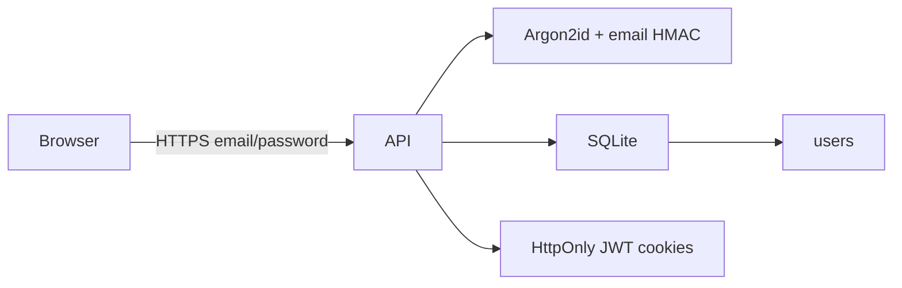

# Backend design

This document describes the Foodpocalypse API: a privacy-first Node.js (Express) service with SQLite, Argon2id passwords, and stateless JWT cookies. It is the source of truth for backend architecture. Operational how-to (install, run) stays out of this file. Domain language is in [`CONTEXT.md`](../CONTEXT.md). Identity decisions: [ADR 0002](adr/0002-password-required.md), [ADR 0003](adr/0003-no-passkeys.md). Rating vs Recommendation: [ADR 0001](adr/0001-rating-overrides-recommendation.md).

Code lives in [`server/`](../server/).

## Goals

- Authenticate with Email and Password only.
- Store as little identifying data as possible.
- Keep session tokens off `localStorage` and out of JavaScript.
- Avoid third-party identity providers, analytics SDKs, and device fingerprinting.

## Explicit non-goals

- Passkeys / WebAuthn.
- Social login (Google, Facebook, or any OAuth identity broker).
- Third-party analytics (Firebase Analytics, Google Analytics, Mixpanel, Facebook SDKs).
- Persistent logging of IP addresses, user-agents, screen size, or hardware IDs.
- Email verification or transactional email (that would require storing or transmitting the raw address).

## Stack

| Layer | Choice |
| --- | --- |
| Runtime | Node.js, TypeScript, ESM |
| HTTP | Express 5 |
| Database | SQLite via `better-sqlite3` + Drizzle ORM |
| Passwords | `argon2` package, **Argon2id** only |
| Tokens | `jose` HS256 JWTs |

In development, Vite proxies `/api` to this server (`http://127.0.0.1:3001`) so the browser stays on one origin and `SameSite=Strict` cookies work. In production (`APP_ENV=production`), Express serves `client/dist` from the same origin.

## Request flow



The API does not look up geolocation, does not persist request metadata, and does not enable `trust proxy`. `X-Powered-By` is disabled. JSON bodies are capped at 64 KB. Parse errors return `{ error: "Bad request" }` with no stack traces.

## Source layout

```
server/src/
  index.ts              HTTP listen
  app.ts                Express app (also used by tests)
  config.ts             env loading
  db/schema.ts          Drizzle tables
  db/index.ts           SQLite open + CREATE TABLE
  routes/auth.ts        /api/auth handlers
  routes/app.ts         products, stores, diets, shopping
  auth/password.ts      Argon2id hash/verify
  auth/email.ts         normalize + HMAC
  auth/jwt.ts           access/refresh JWTs
  auth/cookies.ts       cookie flags and names
  auth/session.ts       issue both tokens
  appEnv.ts             local | production | test
  domain/               glossary rules (mark, store location, nutrients)
```

## Data model

SQLite file: `server/data/foodpocalypse.sqlite` (configurable via `SQLITE_PATH`). WAL mode and foreign keys are on. Tables are created on startup if missing.

### `users`

| Column | Type | Notes |
| --- | --- | --- |
| `id` | TEXT PK | UUIDv4 |
| `email_hash` | TEXT UNIQUE | HMAC-SHA256 of normalized email |
| `password_hash` | TEXT NOT NULL | Argon2id encoded hash |
| `created_at` | INTEGER | Unix milliseconds |

Raw email is never written to SQLite. Every User has a Password.

App tables (`products`, `stores`, `diet_profiles`, shopping lists, join tables) are owned by `users.id` with cascade delete. A Product has an optional `listing_url`. `(user_id, upc)` is unique when a UPC is present. `product_diet_ratings` stores optional `rating` (User) and `recommendation` (system); the visible mark is Rating, else Recommendation, else blank.

## Email handling

1. Trim and lowercase (`normalizeEmail`).
2. Lookup key: `HMAC-SHA256(EMAIL_PEPPER, normalizedEmail)` as hex (`hashEmail`).
3. Display: if the client sent an email at register/login, it is copied into the JWT `email` claim only. It is not persisted.

`EMAIL_PEPPER` must stay secret. Rotating it invalidates every stored email hash (users cannot be looked up by email until re-hashed). Email does not change.

## Password hashing

Module: [`server/src/auth/password.ts`](../server/src/auth/password.ts).

- Library: `argon2`
- Variant: `argon2id` only (not Argon2i, Argon2d, or bcrypt)
- Parameters: `memoryCost` 19456 KiB, `timeCost` 2, `parallelism` 1
- Password length on register: 8–128 characters

Login always runs `argon2.verify` against either the stored hash or a dummy hash so missing accounts do not take a faster path. Failures use a generic `"Invalid email or password"`. Duplicate register uses `"Unable to create account"` without saying the email exists.

## Sessions (JWT cookies)

Tokens are stateless. Nothing about the session is stored in SQLite.

| Cookie | JWT `typ` | TTL | Purpose |
| --- | --- | --- | --- |
| `fp_access` | `access` | 15 minutes | API session |
| `fp_refresh` | `refresh` | 7 days | mint a new access (+ refresh) pair |

Cookie flags:

- `HttpOnly`
- `SameSite=Strict`
- `Path=/`
- `Secure` when `APP_ENV=production` (off on local so `http://localhost` login works)

Signing: HS256 via `jose` and `JWT_SECRET`. Claims: `sub`, `typ`, optional `email`, `iat` / `exp`.

Tokens are never written to `localStorage`. Logout expires the cookies; old JWTs remain cryptographically valid until `exp` (stateless tradeoff; there is no server-side denylist).

`POST /api/auth/refresh` reads `fp_refresh`, checks `typ === "refresh"`, and re-issues both cookies.

## HTTP API (auth)

Base path: `/api/auth`. Mutating routes expect `Content-Type: application/json` except `logout` / `refresh` / `me` (cookie only). The browser must send cookies (`credentials: "include"`).

| Method | Path | Auth | Success | Body / notes |
| --- | --- | --- | --- | --- |
| POST | `/register` | no | 201 `{ id }` | `{ email, password }` |
| POST | `/login` | no | 200 `{ id }` | `{ email, password }` |
| GET | `/me` | access cookie | 200 `{ id, email? }` | email only if present on the JWT |
| POST | `/refresh` | refresh cookie | 200 `{ id }` | rotates access + refresh cookies |
| POST | `/logout` | no | 204 | clears `fp_access` and `fp_refresh` |

Error shape: `{ error: string }`. Auth failures are generic; they do not distinguish unknown email vs wrong password.

## HTTP API (app)

Base path: `/api`. Every route below requires the `fp_access` cookie and answers 401 without it. Mutating routes expect `Content-Type: application/json`. Rows are the complete surface; `server/test/api-surface.test.ts` fails if the router and this table drift apart.

| Method | Path | Success | Body / notes |
| --- | --- | --- | --- |
| POST | `/products/upc-lookup` | 200 `{ result }` | `{ upc }`. 400 `Enter a valid UPC` before any external call; 404 when Open Food Facts has no Product; 502 when the lookup is unavailable |
| GET | `/products` | 200 `{ products }` | each Product carries `storeIds` and raw `ratings` |
| POST | `/products` | 201 `{ product }` | `{ name, upc?, brand?, ingredients?, nutrition?, sourceType?, imageUrl?, notes?, listingUrl? }`. 400 on a duplicate UPC |
| GET | `/products/:id` | 200 `{ product, stores, unlinkedStores, ratings, dietProfiles }` | `ratings` are filtered to active Diet profiles with a visible mark |
| PATCH | `/products/:id` | 200 `{ product }` | `{ listingUrl }` only; `null` clears it |
| POST | `/products/:id/stores` | 204 | `{ storeId }`. Records an Availability |
| POST | `/products/:id/ratings` | 201 / 200 `{ rating, recommendation, mark }` | `{ dietProfileId, rating }`. 201 on first Rating, 200 on update |
| GET | `/stores` | 200 `{ stores }` | sorted by name |
| POST | `/stores` | 201 `{ store }` | `{ name, address }`. 400 unless the location is a street address or an http(s) URL |
| GET | `/diets` | 200 `{ diets }` | each Diet profile carries its Tracked nutrients |
| POST | `/diets` | 201 `{ diet }` | `{ name, nutrients? }`. Unknown nutrients are dropped |
| PATCH | `/diets/:id` | 200 `{ diet }` | `{ name?, active? }` |
| POST | `/diets/:id/nutrients` | 204 | `{ nutrient }`. 400 off the closed list; adding twice is a no-op |
| DELETE | `/diets/:id/nutrients/:nutrient` | 204 | nutrient is URL-encoded in the path |
| GET | `/shopping` | 200 `{ list, items }` | opens the current list if there is none; items oldest first |
| POST | `/shopping/items` | 201 `{ item }` | `{ name, productId? }`. A linked Product supplies the name |
| PATCH | `/shopping/items/:id` | 200 `{ item }` | `{ checked }`. Scoped to the current list |
| POST | `/shopping/archive` | 200 `{ list }` | archives the current list and opens a fresh one. 400 when it is empty |
| GET | `/shopping/history` | 200 `{ lists }` | archived lists with their items, newest first |

Reads are scoped to the signed-in User in SQL rather than filtered afterwards, so a join table never leaves its owner. Unmatched paths under `/api` return 404 `{ error: "Not found" }` as JSON, ahead of the SPA fallback, so a stale client URL never receives `index.html`.

## Environment

Three environments: **local** (default), **production**, and **test**. `APP_ENV` selects one; if it is unset, `NODE_ENV=production` means production, `NODE_ENV=test` means test, otherwise local. See [ADR 0004](adr/0004-process-env-in-production.md).

Local loads [`server/.env`](../server/.env.example). Production and test do not: the host or the test harness injects variables. Production checklist: [`server/.env.production.example`](../server/.env.production.example).

| Variable | Required | Role |
| --- | --- | --- |
| `APP_ENV` | no | `local` \| `production` \| `test` |
| `PORT` | no (default 3001) | listen port |
| `NODE_ENV` | no | `production` also selects the production app env |
| `JWT_SECRET` | yes | HMAC key for JWTs |
| `EMAIL_PEPPER` | yes | HMAC key for email hashes |
| `SQLITE_PATH` | no | SQLite file, relative to `server/` |
| `DEFAULT_USER_EMAIL` | no | If both default User vars are set and the database has no User, seed one |
| `DEFAULT_USER_PASSWORD` | no | Password for that seed User (8–128 characters) |

`APP_ENV=production` enables `Secure` cookies and static SPA hosting (`client/dist`).

## Privacy checklist

What is stored in SQLite:

- User UUID
- Email HMAC
- Argon2id password hash
- User-owned products, stores, diet profiles, ratings, shopping lists

What is not stored:

- Plaintext email or password
- IP, user-agent, geolocation
- Device fingerprint, screen metrics, hardware IDs
- Analytics events
- OAuth tokens or social-account IDs
- Passkey / WebAuthn material

What exists only in cookies:

- JWT session (`sub` + optional email)
